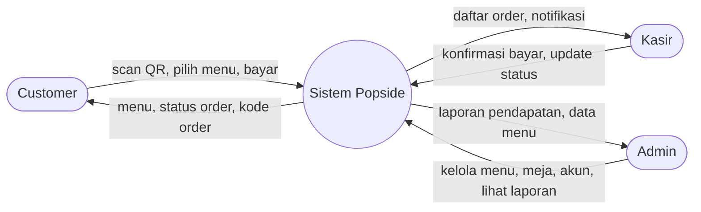
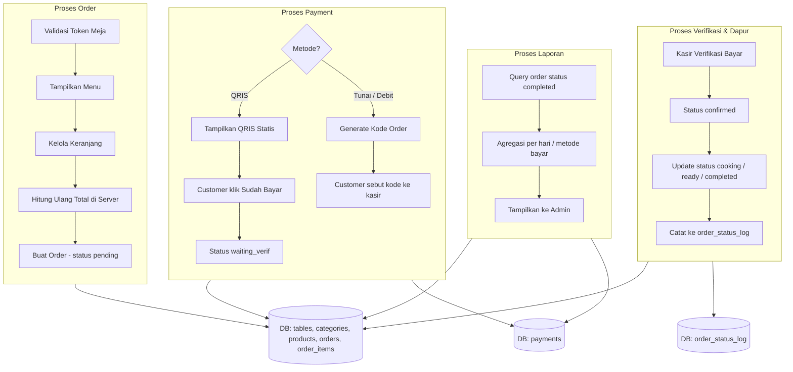
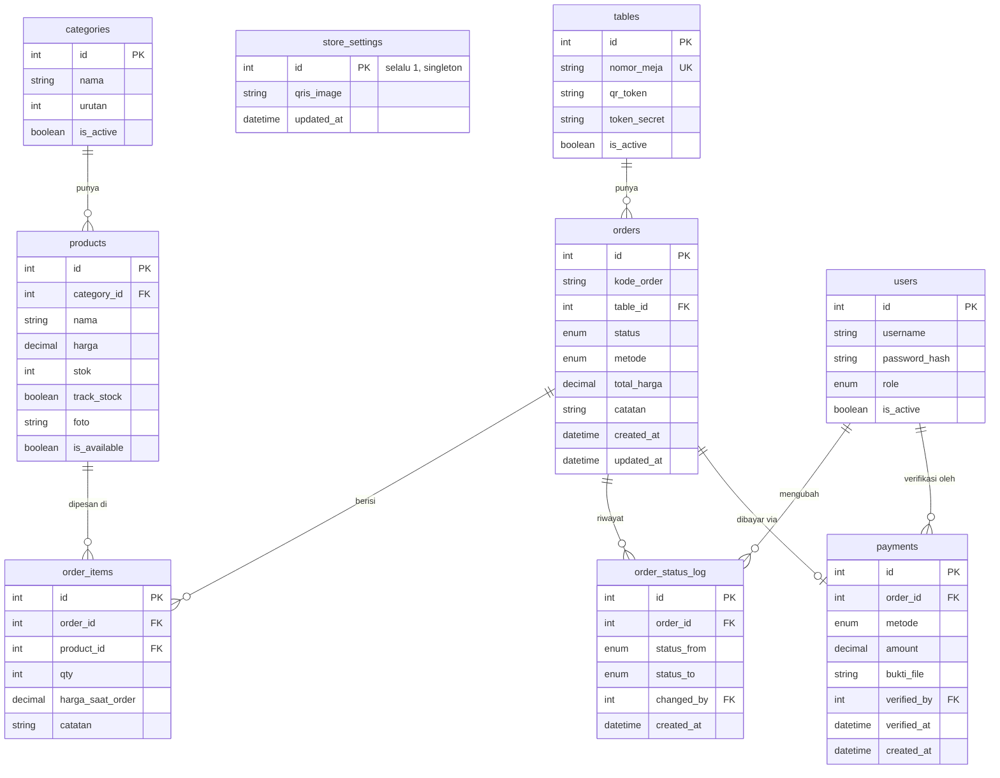

# ERD & DFD — Popside QR Ordering System

## DFD Level 0 (Context Diagram)



## DFD Level 1 (Breakdown Proses)



## ERD



Perubahan dari draf awal (lihat riwayat chat untuk alasan lengkap): tambah kolom `catatan` di `orders`/`order_items`, tambah `token_secret` per meja, tambah `track_stock` di `products`, tambah `verified_at` di `payments`, tambah tabel `order_status_log` sebagai audit trail. Sprint 4: tambah `@unique` di `tables.nomor_meja` (dulu cuma dicek di level aplikasi, sekarang di-enforce DB juga), tambah tabel `store_settings` (singleton, nyimpen gambar QRIS statis toko).

## Skema Prisma (`api/prisma/schema.prisma`)

```prisma
generator client {
  provider = "prisma-client-js"
}

datasource db {
  provider = "mysql"
  url      = env("DATABASE_URL")
}

enum OrderStatus {
  pending
  waiting_verif
  confirmed
  cooking
  ready
  completed
  cancelled
}

enum PaymentMethod {
  qris
  tunai
  debit
}

enum UserRole {
  admin
  kasir
}

model Table {
  id          Int     @id @default(autoincrement())
  nomorMeja   String  @unique @map("nomor_meja")
  qrToken     String  @unique @map("qr_token")
  tokenSecret String  @map("token_secret")
  isActive    Boolean @default(true) @map("is_active")
  orders      Order[]

  @@map("tables")
}

// Singleton row (always id=1) — store-wide settings that aren't specific
// to any product/category/table. Currently just the static QRIS image
// shown at checkout (MEMORY.md: one shared QRIS image for the whole
// store, not a per-transaction dynamic code).
model StoreSetting {
  id        Int      @id @default(1)
  qrisImage String?  @map("qris_image")
  updatedAt DateTime @updatedAt @map("updated_at")

  @@map("store_settings")
}

model Category {
  id       Int       @id @default(autoincrement())
  nama     String
  urutan   Int       @default(0)
  isActive Boolean   @default(true) @map("is_active")
  products Product[]

  @@map("categories")
}

model Product {
  id          Int         @id @default(autoincrement())
  categoryId  Int         @map("category_id")
  category    Category    @relation(fields: [categoryId], references: [id])
  nama        String
  harga       Decimal
  stok        Int         @default(0)
  trackStock  Boolean     @default(false) @map("track_stock")
  foto        String?
  isAvailable Boolean     @default(true) @map("is_available")
  orderItems  OrderItem[]

  @@index([categoryId])
  @@map("products")
}

model Order {
  id         Int              @id @default(autoincrement())
  kodeOrder  String           @unique @map("kode_order")
  tableId    Int              @map("table_id")
  table      Table            @relation(fields: [tableId], references: [id])
  status     OrderStatus      @default(pending)
  metode     PaymentMethod
  totalHarga Decimal          @map("total_harga")
  catatan    String?
  createdAt  DateTime         @default(now()) @map("created_at")
  updatedAt  DateTime         @updatedAt @map("updated_at")
  items      OrderItem[]
  payment    Payment?
  statusLogs OrderStatusLog[]

  @@index([status])
  @@index([createdAt])
  @@index([tableId])
  @@map("orders")
}

model OrderItem {
  id             Int     @id @default(autoincrement())
  orderId        Int     @map("order_id")
  order          Order   @relation(fields: [orderId], references: [id])
  productId      Int     @map("product_id")
  product        Product @relation(fields: [productId], references: [id])
  qty            Int
  hargaSaatOrder Decimal @map("harga_saat_order")
  catatan        String?

  @@index([orderId])
  @@index([productId])
  @@map("order_items")
}

model OrderStatusLog {
  id            Int         @id @default(autoincrement())
  orderId       Int         @map("order_id")
  order         Order       @relation(fields: [orderId], references: [id])
  statusFrom    OrderStatus @map("status_from")
  statusTo      OrderStatus @map("status_to")
  changedBy     Int?        @map("changed_by")
  changedByUser User?       @relation(fields: [changedBy], references: [id])
  createdAt     DateTime    @default(now()) @map("created_at")

  @@index([orderId])
  @@map("order_status_log")
}

model User {
  id           Int              @id @default(autoincrement())
  username     String           @unique
  passwordHash String           @map("password_hash")
  role         UserRole
  isActive     Boolean          @default(true) @map("is_active")
  statusLogs   OrderStatusLog[]
  payments     Payment[]

  @@map("users")
}

model Payment {
  id             Int           @id @default(autoincrement())
  orderId        Int           @unique @map("order_id")
  order          Order         @relation(fields: [orderId], references: [id])
  metode         PaymentMethod
  amount         Decimal
  buktiFile      String?       @map("bukti_file")
  verifiedBy     Int?          @map("verified_by")
  verifiedByUser User?         @relation(fields: [verifiedBy], references: [id])
  verifiedAt     DateTime?     @map("verified_at")
  createdAt      DateTime      @default(now()) @map("created_at")

  @@index([orderId])
  @@map("payments")
}
```

## Index Wajib (rekap)

- `orders.status`, `orders.created_at`, `orders.table_id` — dashboard & laporan sering filter/sort berdasarkan ini.
- `orders.kode_order` — UNIQUE, dipakai untuk lookup tracking.
- `order_items.order_id`, `order_items.product_id` — FK, sering di-join.
- `products.category_id` — FK, filter menu per kategori.
- `order_status_log.order_id` — FK, tarik riwayat per order.
- `tables.qr_token` — UNIQUE, lookup saat scan QR.
- `tables.nomor_meja` — UNIQUE, dua meja tidak boleh punya nomor sama.
