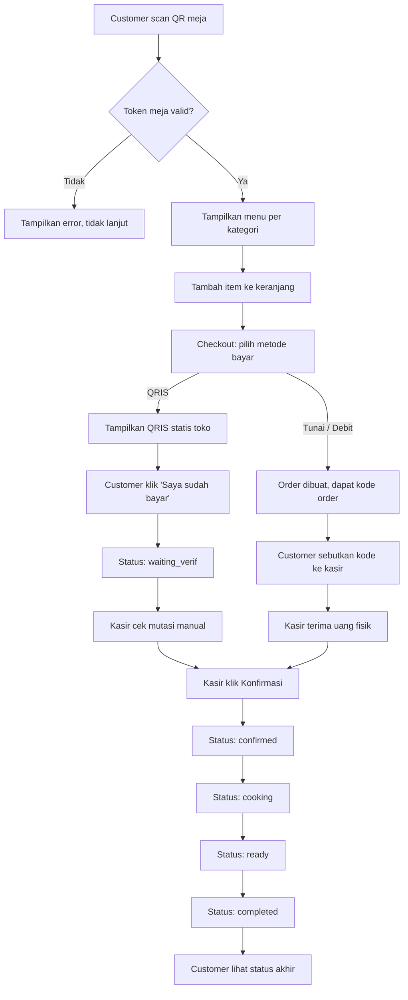

# PRD — Popside QR Ordering System

## 1. Latar Belakang & Tujuan

Popside butuh sistem pemesanan mandiri berbasis QR per meja, supaya customer bisa pesan tanpa menunggu pelayan, dan kasir/admin punya satu dashboard untuk mengelola semua pesanan masuk sekaligus memantau pendapatan harian.

## 2. Aktor

| Aktor | Login | Deskripsi |
|---|---|---|
| Customer | Tidak | Duduk di meja, scan QR, pesan, bayar, tracking status |
| Kasir | Ya | Konfirmasi pesanan & pembayaran, update status dapur |
| Admin | Ya | Semua akses kasir + kelola menu, kelola akun kasir, lihat laporan |

## 3. User Stories

**Customer**

- Sebagai customer, saya scan QR di meja saya supaya sistem tahu saya duduk di meja mana, tanpa perlu daftar/login.
- Sebagai customer, saya bisa melihat menu berdasarkan kategori beserta harga, foto, dan status tersedia/habis.
- Sebagai customer, saya bisa menambah item ke keranjang, memberi catatan per item (misal "less sugar"), dan mengubah jumlah sebelum checkout.
- Sebagai customer, saya bisa memilih bayar QRIS, tunai, atau debit.
- Sebagai customer yang bayar QRIS, saya diarahkan ke gambar QRIS toko, lalu klik "saya sudah bayar" setelah transfer.
- Sebagai customer yang bayar tunai/debit, saya mendapat kode order yang saya sebutkan ke kasir untuk konfirmasi.
- Sebagai customer, saya bisa memantau status pesanan saya (menunggu verifikasi/dikonfirmasi/dimasak/siap/selesai) tanpa perlu refresh manual.

**Kasir**

- Sebagai kasir, saya login dengan aman ke dashboard.
- Sebagai kasir, saya melihat daftar pesanan masuk, terurut dari yang paling butuh perhatian (`waiting_verif` diprioritaskan).
- Sebagai kasir, saya bisa mencocokkan kode order yang disebutkan customer dengan data di sistem.
- Sebagai kasir, saya bisa mengonfirmasi pembayaran (setelah cek mutasi manual untuk QRIS, atau menerima cash/debit fisik).
- Sebagai kasir, saya mengupdate status pesanan sesuai progres dapur.

**Admin**

- Semua yang bisa dilakukan kasir.
- Sebagai admin, saya mengelola menu (tambah/edit/hapus kategori & produk, atur stok & ketersediaan).
- Sebagai admin, saya mengelola akun kasir (membuat/menonaktifkan akun).
- Sebagai admin, saya melihat laporan pendapatan harian & riwayat pesanan.

## 4. Flow Utama

## 5. Functional Requirements

1. Validasi token QR meja (HMAC-signed) sebelum sesi keranjang dimulai.
2. Tampilan menu dengan kategori, harga, foto, status ketersediaan.
3. Keranjang: tambah/kurangi qty, catatan per item, total dihitung ulang di server (bukan memercayai input frontend).
4. Checkout dengan 3 metode bayar (QRIS/tunai/debit), masing-masing dengan flow sendiri (lihat `MEMORY.md`).
5. Generate kode order unik anti-tebak.
6. Halaman tracking status order (polling atau realtime via Socket.IO).
7. Dashboard admin: list order + filter status, detail order, aksi konfirmasi/update status.
8. Laporan pendapatan harian (total transaksi, breakdown per metode bayar).
9. Kelola menu (CRUD kategori & produk) — admin only.
10. Kelola akun kasir — admin only.
11. Login admin/kasir dengan session-based auth, RBAC dua role.

## 6. Non-Functional Requirements

- Mobile-first: public web harus nyaman dipakai satu tangan di HP, target waktu muat < 2 detik di koneksi 4G biasa.
- Public web tetap harus bisa dipakai walau banyak meja order bersamaan (concurrency-safe lewat DB transaction).
- Semua endpoint publik dibatasi rate limit.
- Tidak ada data sensitif (harga, session admin) tersimpan di `localStorage`.
- Error di production tidak pernah menampilkan detail teknis ke user.

## 7. Out of Scope (MVP ini TIDAK mengerjakan)

- Payment gateway otomatis (Midtrans/Xendit, dll) — QRIS tetap manual di fase ini.
- Akun/login untuk customer, riwayat pesanan lintas sesi.
- Multi-outlet / multi-cabang.
- Loyalty point / membership.
- Integrasi printer struk/dapur (ESC/POS).
- Aplikasi mobile native (hanya web, mobile-first).
- Kitchen display screen terpisah (status dapur diupdate manual oleh kasir/admin dari dashboard yang sama).

## 8. Success Metrics

- Customer bisa menyelesaikan satu pesanan penuh (scan sampai checkout) dalam < 2 menit tanpa bantuan staff.
- Kasir bisa mengonfirmasi satu pesanan dalam < 15 detik dari saat customer menyebutkan kode.
- Nol insiden harga/total yang salah akibat manipulasi frontend (diverifikasi lewat test manual di setiap sprint terkait).
